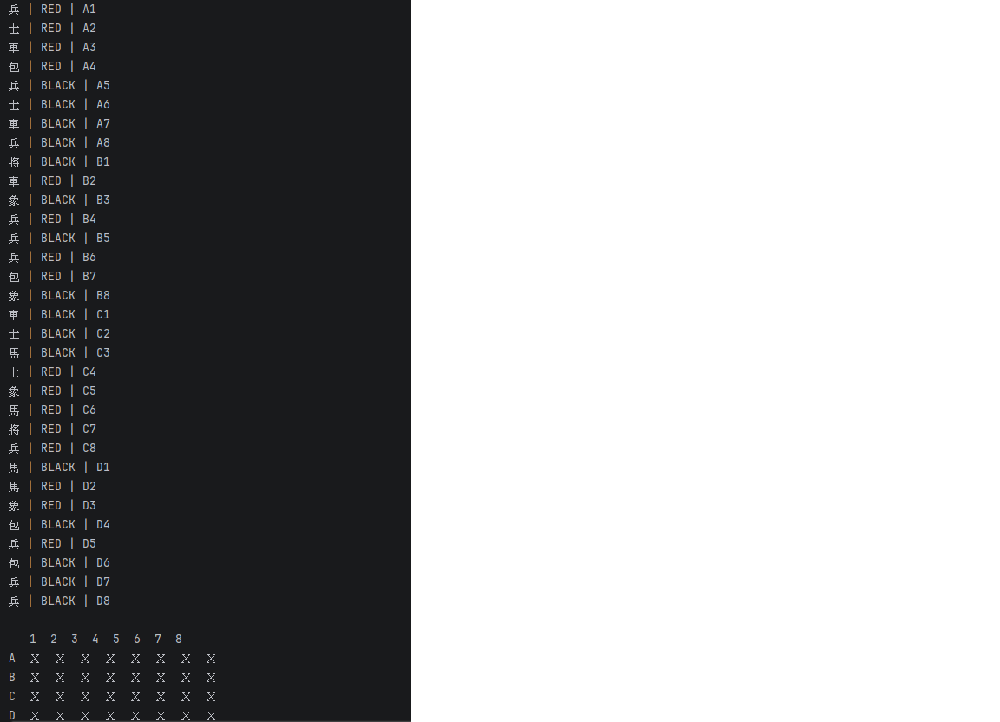
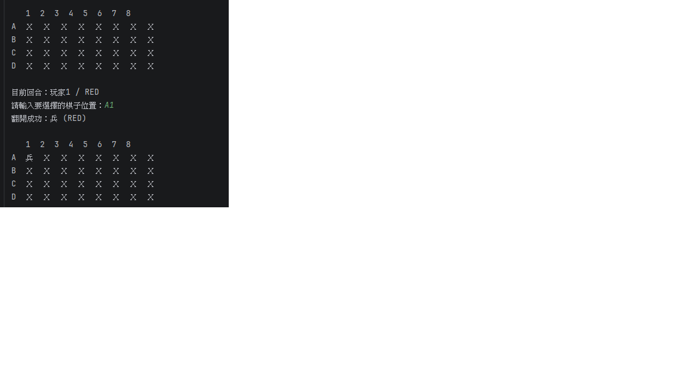
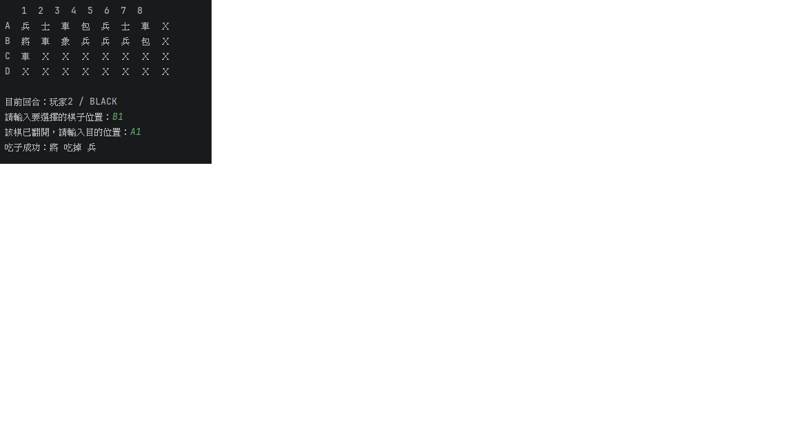

# H1 Report

* Name: 陳智勇
* ID: D1130819

---

## 題目：象棋翻棋遊戲 (Chinese Dark Chess)

本作業實作一個簡單的象棋翻棋 (暗棋) 系統。  
棋盤大小為 **4x8**，共有 **32 顆棋子**，包含紅方與黑方棋子各 16 顆。  
遊戲開始時所有棋子隨機排列並且覆蓋，玩家透過 console 輸入棋盤座標 (例如 A2, B3) 進行翻棋、移動與吃子。

程式使用 **OOP (Object-Oriented Programming)** 的方式設計，並透過抽象類別與多個類別分工來完成整個遊戲系統。

---

# 設計方法概述

本程式主要使用以下幾個類別：

### 1. AbstractGame
抽象類別，定義遊戲基本方法：

- `setPlayers(Player, Player)`
- `gameOver()`
- `move(int location)`

`ChessGame` 會繼承這個類別並實作具體邏輯。

---

### 2. Chess
代表一顆棋子，包含以下屬性：

- `name` : 棋子名稱
- `weight` : 棋子等級 (用於判斷吃子)
- `side` : 陣營 (RED / BLACK)
- `loc` : 棋子位置
- `revealed` : 是否翻開
- `alive` : 是否存活

---

### 3. ChessGame
負責整個遊戲邏輯，例如：

- 隨機產生 32 顆棋子
- 將棋子隨機排列到棋盤
- 顯示棋盤
- 玩家翻棋
- 玩家移動棋子
- 玩家吃子
- 判斷遊戲是否結束

---

### 4. Player
表示遊戲玩家，包含：

- 玩家名稱
- 玩家陣營

---

### 5. Side
列舉型別 (Enum)，表示棋子的陣營：

- RED
- BLACK

---

### 6. PositionUtil
負責棋盤座標轉換，例如：
A1 -> index
index -> A1

這樣使用者就可以透過簡單的棋盤座標 (A1、B3 等) 來操作棋子。

---

# 程式、執行畫面及其說明

程式開始時，會建立棋盤並隨機排列棋子。

棋盤顯示如下：
1 2 3 4 5 6 7 8
A X X X X X X X X
B X X X X X X X X
C X X X X X X X X
D X X X X X X X X

# 執行畫面

## 初始棋盤

---

## 翻棋畫面

---

---

## 吃子畫面

---

# AI 使用狀況與心得

使用層級：  
**(層級 3) 一開始就使用 AI，搭配局部的自己撰寫**

在本次作業中，我使用 AI 協助完成以下部分：

- 設計程式的 OOP 類別架構
- 建立 AbstractGame 抽象類別
- 協助實作 Chess 與 ChessGame 類別
- 協助設計棋盤顯示與移動邏輯
- 協助修正程式錯誤

在開發過程中，我多次與 AI 互動，例如：

- 詢問如何設計棋子類別
- 詢問如何實作棋盤座標轉換
- 修正程式錯誤
- 改進程式結構

AI 提供了程式架構與範例程式碼，讓我可以更快理解如何完成整個遊戲系統。

---

## 自己手動完成的部分

以下部分為自己手動完成：

- IntelliJ 專案建立
- GitHub Classroom 作業提交
- 程式測試與執行
- 執行畫面截圖
- 報告整理與 PDF 轉換

---

# 心得

透過這次作業，我學習到如何使用 **Java 的物件導向程式設計 (OOP)** 來設計一個完整的系統。

在實作過程中，我理解了：

- 如何使用類別表示不同物件
- 如何使用抽象類別設計系統架構
- 如何透過方法管理遊戲邏輯

AI 在程式設計過程中提供了很大的幫助，例如提供程式架構與解決錯誤。但仍需要自己理解程式邏輯並進行測試，才能確保程式正確運作。

透過這次練習，我對 Java 的物件導向設計與類別分工有更深入的理解。